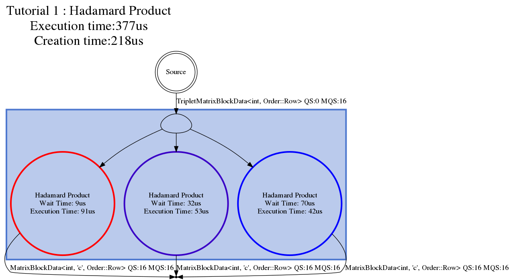

# Content
- [Goal](#goal)
- [Computation](#computation)
- [Data structure](#data-structure)
- [Task](#computation-task)
- [Graph](#graph)
- [Conclusion](#conclusion)

----

# Goal
The first tutorial computes the Hadamard product (element-wise product) of two matrices A and B. The computation is made in a block-based fashion to exploit parallelism with the library. 

The base API that is presented:
* Create a simple graph,
* Define a CPU based Task,
* Push data into the graph and get results out of it,
* Do and visualize the computation. 

----

# Computation
The computation is decomposed as follow:
1. Decompose the matrices into blocks (handled outside the graph), 
2. Do the element-wise product of A and B, and, store the result into C.

----

# Data structure
We will use data structures that will wrap the data array plus some convenient accessors:
* MatrixData<T, Id, Order>: A matrix, 
* MatrixBlockData<T, Id, Order>: A matrix block, 
* TripleMatrixBlockData<T, Order>: The corresponding block from matrix A, matrix B and matrix C.

These data structures are specialized with the following elements:
* Type: The type of the matrix elements, 
* Id: The matrix identifier, a, b, or, c,
* Ord: The way the matrix is ordered, row based, or, column based. 

----

# Computation task
In Hedgehog the *AbstractTask* represents compute kernels. Each task can have multiple input types and only one output type. 

In this example, only one computation task is needed with one input type and one output type, the Hadamard product task. It will have as input the triplet of blocks from the matrices A, B and C, and have as output the block of C filled with the values from element-wise multiplying A and B.

To create a task for Hedgehog, we create a class that will inherit publicly from *AbstractTask* with the needed input and output:


```cpp
template<class Type, Order Ord>
class HadamardProduct : public AbstractTask<MatrixBlockData<Type, 'c', Ord>, TripletMatrixBlockData<Type, Ord>>
```

Note the order of specializations: for the task the output type is written first, *MatrixBlockData<Type, 'c', Ord>*, and the input type after, *TripletMatrixBlockData<Type, Ord>*.
 
The constructor of the *HadamardProduct* takes two arguments:
```cpp
HadamardProduct(std::string_view const &name, size_t numberThreads)
      : AbstractTask<MatrixBlockData<Type, 'c', Ord>, TripletMatrixBlockData<Type, Ord>>(name, numberThreads)
 ```
* name: The name of my task, 
* numberThreads: The number of threads associated with this task. 

We want to compute multiple blocks of A, B and, C at the same time, so we will create a *cluster* of *HadamardProduct* tasks. This is done by creating multiple instances of the *HadamardProduct*. The number of instances is given to the Hedgehog library through the *numberThreads* parameter in the *AbstractTask* constructor. 

Hedgehog will take care of creating the instances for us, but it needs information how to "duplicate" the task, which is done by overriding the "copy" method, defined as follow for our *HadamardProduct* task:
 ```cpp
   std::shared_ptr<AbstractTask<MatrixBlockData<Type, 'c', Ord>, TripletMatrixBlockData<Type, Ord>>> copy() override {
     return std::make_shared<HadamardProduct>(this->name(), this->numberThreads());
   }
  ```
The *copy* method is made to create a new instance of a specialized *AbstractTask* from the current one. So if attributes need to be shared among the task, they need to be transferred via the copy method, in our case, the name of the task and the number of threads. Because each copy will live on their own thread, if data needs to be shared within a cluster of tasks then some arrangements may need to be made to ensure thread safety when accessing the shared data such as by sharing locks. The *AbstractTask* makes no guarantees for data safety when variables/data is shared by the *copy* function.
   
Note here that the copy method is only needed if the *numberThreads* is greater than 1 (one).
   
The computation kernel of the task is defined with the method *execute*:
```cpp
 void execute(std::shared_ptr<TripletMatrixBlockData<Type, Ord>> triplet) override {
     // Do the computation 
     this->addResult(blockC);
   }
```
When a *TripletMatrixBlockData<Type, Ord>* is sent to the *HadamardProduct* task, the execute method is fired. This is where the computation is done, in our case the element-wise product (see the tutorial code for the implementation). The call of the *addResult* method is made to send an output of the task, here a *MatrixBlockData<Type, 'c', Ord>*. 

The *execute* method is called for every element in the task's input queue. Having multiple elements in this queue, and having *numberThreads* greather than one enables scaling to multi-core CPUs because each thread will operate on independent *TripletMatrixBlockData* in parallel.

The only mandatory method definitions from the *AbstractTask* are the *execute* methods for each task's input type and if the number of thread is more than 1 (one), the copy method. 

In the main function we will just instantiate the *HadamardProduct<MatrixType, Ord>* as follow:
```cpp
auto hadamardProduct = std::make_shared<HadamardProduct<MatrixType, Ord>>("Hadamard Product", numberThreadHadamard);
```

A *shared_ptr* is created to operate within Hedgehog and ensure that memory is reclaimed to avoid leaks. 

----

# Graph
The Hedgehog *Graph* type represents a handle for the computation by the Hedgehog library. Similar to a task, the graph has multiple input types and only one output type. In our case only one input type is needed, the triplet of blocks, and as output a block of C matrix:
```cpp
 Graph<MatrixBlockData<MatrixType, 'c', Ord>, TripletMatrixBlockData<MatrixType, Ord>> graphHadamard("Tutorial 1 : Hadamard Product");
```

We will connect the *hadamardProduct* task to the *graphHadamard* as follow: 
```cpp
  graphHadamard.input(hadamardProduct);
  graphHadamard.output(hadamardProduct);
```

We set the task as input and output of the graph, which mean:
* For the input: Every data sent to the graph that corresponds to one of the inputs of the task, will be sent to each task designated as input, 
* For the output: Every data is sent by the task via *addResult* will be served as output for the graph.

This is only possible because the task is compatible with the graph:
* For the input: A task (or nodes that can accept a data), is compatible with a graph if *at least* one of its input types is the same as one of the graph's input types,  
* For the output: A task (or nodes that can produce a data), is compatible with a graph if its output type is the same as the graph's output type.

Once the graph is set, the graph can be executed. The function *executeGraph* is called to spawn the threads. After this call, the graph is ready to accept input data:
```cpp
  graphHadamard.executeGraph();
```

To push an input data into the graph we call for a triplet of blocks:
```cpp
graphHadamard.pushData(triplet);
```

When no more data will be pushed into the graph, we notify the graph:
```cpp
graphHadamard.finishPushingData();
```

Then we can wait for the results blocks:
```cpp
while (auto blockResults = graphHadamard.getBlockingResult()) {
  std::cout << *blockResult << std::endl;
}
```
*getBlockingResult* will block the main thread execution until it gets data out of the graph. When there is no longer data being produced by the graph, *getBlockingResult* will send nullptr, which will break the while loop. 

The final method to call is *waitForTermination* to wait for all inside threads to join:
```cpp
graphHadamard.waitForTermination();
```

Here we have the sequence of mandatory call to create, set, execute, push data, get results and terminate a graph:
```cpp
// Graph Constructor 
Graph<MatrixBlockData<MatrixType, 'c', Ord>, TripletMatrixBlockData<MatrixType, Ord>> graphHadamard("Tutorial 1 : Hadamard Product");

// Set The hadamard task as the task that will be connected to the graph inputs
graphHadamard.input(hadamardProduct);
// Set The hadamard task as the task that will be connected to the graph output
graphHadamard.output(hadamardProduct);

// Execute the graph
graphHadamard.executeGraph();

// Push the data in the graph
graphHadamard.pushData(triplet);

// Notify the graph that no more data will be sent
graphHadamard.finishPushingData();

// Loop over the different resulting block of C
while (auto blockResults = graphHadamard.getBlockingResult()) {}

// Wait for everything to be processed
graphHadamard.waitForTermination();
```

A Hedgehog graph can produce a visualization of their current state, in the dot file format. This visualization is useful to understand, debug, and improve a computation. An ulterior tutorial is dedicated to the usage of this visualization.
Here is the code to produce one of them:
```cpp
graphHadamard.createDotFile("Tutorial1HadamardProduct.dot", ColorScheme::EXECUTION, StructureOptions::ALL);
```

And here is the visualization:


----

# Conclusion
We have seen in this tutoriel:
* How to create a multi-threaded task,  
* What are the task's mandatory methods, 
* How to create and run a Hedgehog graph, 
* What are the rules to link a task to a graph,
* How to design the Hadamard Product within Hedgehog.
