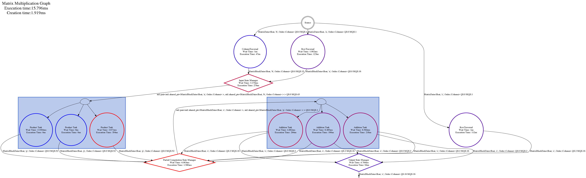

# Content
- [Goal](#goal)
- [Computation](#computation)
- [Data structure](#data-structure)
- [Task](#computation-task)
- [State and State Manager](#state-and-state-manager)
- [Graph](#graph)
- [Conclusion](#conclusion)

----

# Goal
This tutorial aims to create a BLAS-like Matrix Multiplication routine (C += A * B) to introduce how to resolve cycles in a Hedgehog graph.

The [OpenBLAS](https://www.openblas.net/) library is required to do the computation. 

----

# Computation
The computation is a BLAS-like Matrix Multiplication routine (C += A * B) with:
* A, a (n * m) random matrix, 
* B, a (m * p) random matrix, 
* C, a (n * p) random matrix.

The computation steps are:
1. A traversal of matrices A, B, and C that produces blocks,
2. The creation of compatible pairs of blocks from A and B,
3. A partial matrix multiplication on the pair of blocks producing a new "temporary block",
4. The accumulation into the C blocks of the compatible temporary blocks,
5. Serve the output block when it is ready. 

Points 1, 3 and 4 will be represented as *tasks*. 

Points 2 and 5 will be represented as *states* and *state managers*, because it represents points where data needs to be gathered or stored temporally to satify dependencies. 

A note here, because we don't know the order of the temporary blocks that are produced from the product and addition *tasks*, an additional *state* and *state manager* is needed in front of the accumulation task.

To create an output block it needs a full row of blocks from matrix A and a full column of blocks from matrix B, so two *tasks* will be implemented to traverse the matrices properly, as shown in the figure below.

 


----

# Data structure
The same data structure representing the matrix and the matrix blocks are reused from [tutorial 1]({{site.url}}/tutorials/tutorial1) and [tutorial 2]({{site.url}}/tutorials/tutorial2). 

The triplet are not used because we do not need to carry a block of A, b and C, just a pair is used for the product. 

A special matrix block specialization with id as "p" is used for the temporary blocks (partial results). 

----

# Computation task
Here the tasks are simple:
* The product task is a call to the *sgemm* (single precision) or *dgemm* (double precision) routine from [OpenBLAS](http://www.openblas.net/),
* the addiction task, the sum of two contiguous pieces of memory.  

----

# State and State Manager
# States
Multiples "states" are defined in this algorithm:
* "InputBlockState": The state is used to create a pair of compatible blocks from matrices A and B. Because each of the blocks are used multiple time, these blocks maintain a "time to leave", which is defined at state construction. When the time to leave reaches 0, then the block is discarded from the temporary storage.
* "OutputState": The state is used to count the number of times the block has been accumulated, and will push the block outside of the graph when the final accumulation is done. 
* "PartialComputationState": The state creates a pair of blocks from a compatible temporary block and block from matrix C. 

# State Manager 
We could have only used the *default state manager* for these states if there were no cycles in the graph.

But because of the cycle between the addition *task* and the partial computation *state*, a special *state manager* has to be defined from the "StateManager", and the "canTerminate" method has to be overloaded to solve the cycle.

```cpp
template<class Type, Order Ord = Order::Row>
class PartialComputationStateManager
    : public hh::StateManager<
        std::pair<std::shared_ptr<MatrixBlockData<Type, 'c', Ord>>, std::shared_ptr<MatrixBlockData<Type, 'p', Ord>>>,
        MatrixBlockData<Type, 'c', Ord>,
        MatrixBlockData<Type, 'p', Ord>
    > {
 public:

  explicit PartialComputationStateManager(std::shared_ptr<PartialComputationState<Type, Ord>> const &state) :
  	  // Calling the StateManager constructor
      hh::StateManager<std::pair<std::shared_ptr<MatrixBlockData<Type, 'c', Ord>>,
                                 std::shared_ptr<MatrixBlockData<Type, 'p', Ord>>>,
                       MatrixBlockData<Type, 'c', Ord>,
                       MatrixBlockData<Type, 'p', Ord>>("Partial Computation State Manager", state, false) {}

  // Redefining canTerminate method
  bool canTerminate() override {
    this->state()->lock();
    auto ret = std::dynamic_pointer_cast<PartialComputationState<Type, Ord>>(this->state())->isDone();
    this->state()->unlock();
    return ret;
  }
};
```

----

# Graph
Hedgehog presents and uses a directed task graph. Which means, that cycles are possible and without special care will end in deadlock. This is because a node, by default, will terminate if these two conditions are true:
1: Are there no "input nodes" (nodes that send data to the considerate nodes) alive ?
2: Are all of the input data queues empty ?

Because of the cycle, it's possible there is no data in the input queues, but for each of them one of their "input nodes" may be alive.

To break the cycle, knowledge specific to the computation is needed to know when it's done, and this test is represented by overloading the "canTerminate" method.

Here is the final graph:


----

# Conclusion
We have seen in this tutoriel:
* How to manage a cycle in a graph.
