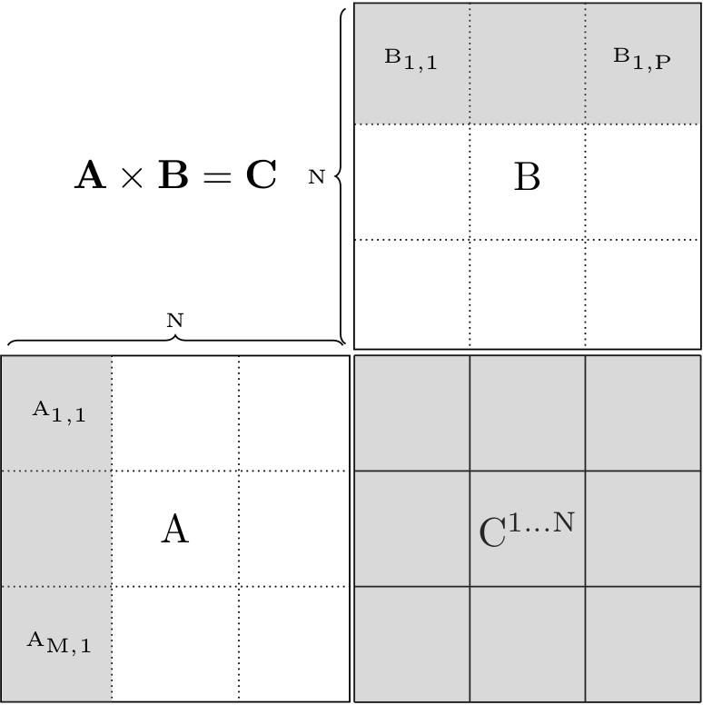
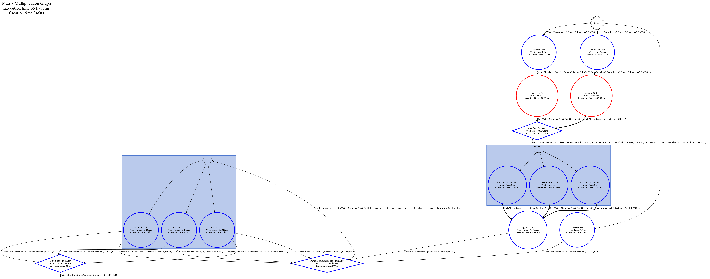

# Content
- [Goal](#goal)
- [Computation](#computation)
- [Data structure](#data-structure)
- [Memory management](#memory-management)
- [Task](#computation-task)
- [Graph](#graph)
- [Conclusion](#conclusion)

----

# Goal
The goal of this tutorial is to create tasks that launch NVIDIA CUDA kernels and, how to use the Hedgehog Memory Management tool. This tutorial is not about developing CUDA code.

----

# Computation
The computation follows the same logic and steps as [tutorial 3]({{site.url}}/tutorials/tutorial3).

In this tutorial, we will port only part of the computation onto the GPU: the "product task". 
Because we are dealing with the GPU, data motion and the amount of data in the GPU must be taken care of:
* Data motion: The process of sending data between address spaces (CPU to GPU). This can be costly, so the data motion is invoked asynchronously, 
* Data amount limitation: The memory on a GPU is limited, so for big matrices, they won't fit in GPU memories, the amount of computation in-flight within a graph will be directed by the amount of memory available to the GPU. 

3 GPU *tasks* will be added:
1. "CudaCopyInGPU": Responsible to send the block from the CPU to the GPU, 
2. "CudaProductTask": Responsible to do the partial product on GPU and produce the temporary block, 
3. "CudaCopyOutGPU":  Reponsible to get back the block from the GPU to the CPU. 

The computation kernel for the "product task" calls the cuBLAS routines. These routines follow a column-based storage model. So the blocks will be stored in column-major order.

The traversal of the matrices is also very important to how much memory is consumed. For matrix multiplication, the earliest time a block can be released for matrices A or B is when it has been fully multiplied by its matching row or column of blocks, respectively. Having this traversal pattern is key to operating on matrices that do not necessarily fit in GPU memory, and will be important in understanding when memory can be recycled. This traversal pattern is shown below:



The remaining *tasks* and *states*, will be taken from [tutorial 3]({{site.url}}/tutorials/tutorial3).

# Data structure
A data structure "CudaMatrixBlockData" has been designed for this tutorial. It inherits from "MatrixBlockData", because it is a block and stores more metadata related to the GPU computation. 

It also inherits from "MemoryData" from the Hedgehog API, to let Hedgehog manage this memory: 
```cpp
template<class Type, char Id>
class CudaMatrixBlockData : public MatrixBlockData<Type, Id, Order::Column>, public MemoryData<CudaMatrixBlockData<Type, Id>>
```
The others are the same as [tutorial 3]({{site.url}}/tutorials/tutorial3).

# Memory Management
The *memory manger* is a tool in Hedgehog that helps developers to limit the amount of data flowing in a graph. 

It consists of a pool and a way to serve instances of an object into a *Task* and recycle its memory. If there are no instances available in the pool, then the task will block until a new instance is available.

## Setup

There is one mandatory parameter that is needed to create a *memory manager*, the pool capacity:
```cpp
explicit AbstractMemoryManager(size_t const &capacity)
```

This pool capacity will set the maximum number of instances of an object that will flow into the graph from this *memory manager*.

Hedgehod defines two *memory managers*:
1. "AbstractMemoryManager": the base *Memory Manager*, the pool will be initialized by calling only the default constructor of the data defined by the user, 
2. "StaticMemoryManager": the static "Memory Manager", the pool will be initialized by calling the specified constructor of the data defined by the user.  

In this example, and in general, especially with CUDA related data, we encourage to use the *static memory manager* to avoid GPU synchronisation during the execution.

The type managed by the *memory manager* is set by defining:
1. The only template type of the "AbstractMemoryManager", 
2. The first template type of the "StaticMemoryManager".

In order for the "StaticMemoryManager" to choose the right constructor at initialization, the signature types must match the other "StaticMemoryManager" template types.

For example, let's define a class "House" as follow:

```cpp
class House : public MemoryData<House>{
 private:
  std::vector<int>
    *family_ = nullptr,
    *pet_ = nullptr;

  size_t
    ttl_ = 0;

 public:
  House () = default;
  House(size_t familySize, size_t petSize, size_t ttl ){
    family_ = new std::vector<int>(familySize);
    pet_ = new std::vector<int>(petSize);
    std::iota(family_->begin(), family_->end(), 0);
    std::iota(pet_->begin(), pet_->end(), family_->size());
    ttl_ = ttl > 0 ? ttl: 1;
  }

  House(size_t familySize, size_t petsSize): House(familySize, petsSize, 1){}

  ~House() final {
    delete family_;
    delete pet_;
  }
};
```

If we want to initialize the pool by calling the following constructor:
```cpp
House(size_t familySize, size_t petSize, size_t ttl )
```
the type of the "StaticMemoryManager" will be: 
```cpp
StaticMemoryManager<House, size_t, size_t, size_t >
```

If we want to initialize the pool by calling the following constructor:
```cpp
House(size_t familySize, size_t petSize )
```
the type of the "StaticMemoryManager" will be: 
```cpp
StaticMemoryManager<House, size_t, size_t>
```

Then when we construct the "StaticMemoryManager", the firt constructor parameter is always the pool capacity, then the remaining constructor parameters are passed to the managed data constructor, so:
```cpp
// Fill the pool with 10 houses calling the constructor House(1, 2, 3)
StaticMemoryManager<House, size_t, size_t, size_t > smm(10, 1, 2, 3); 

// Fill the pool with 42 houses calling the constructor House(98, 1)
StaticMemoryManager<House, size_t, size_t > smm(42, 98, 1); 
```

## Recycling mechanism

All the *memory managers* come with a recycling mechanism. When MemoryData::returnToMemoryManager() is invoked, the recycling mechanism is used which consists of calling the following virtual methods, in the following order:
1. MemoryData::used(): Method used to update the "state" of the MemoryData (for example in the case the MemoryData is returned to the AbstractMemoryManager multiple times before being recycled and sent back to the Pool.
2. MemoryData::canBeRecycled(): Boolean method to determine if the MemoryData can be recycled, and sent back to the Pool.
3. MemoryData::recycle(): Recycle the MemoryData. The data given by the AbstractMemoryManager is default constructed the first time. If specialized class attributes are allocated, they should be deallocated in this method, to avoid memory leaks, to return the ManagedMemory to the same state as default construction.

The same behavior, is used by the *StaticMemoryManager*, only, no other allocation *should* be made by the user, so MemoryData::recycle() can be used to clean the data if needed to be reused later on. The *managed memory* will be deallocated during the pool destruction.

## Usage in tutorial

We are using the *memory manager* to throttle the memory on the GPU so that we stay within the limits of GPU memory. In addition, we use the "StaticMemoryManager" to pre-allocate a pool of CUDA memories rather than dynamic allocation. Dynamic GPU allocation may cause GPU device synchronization, resulting in reductions in performance.
```cpp
// MemoryManagers
auto cudaMemoryManagerA =
  std::make_shared<hh::StaticMemoryManager<CudaMatrixBlockData<MatrixType, 'a'>, size_t>>(nBlocks + 4, blockSize);
auto cudaMemoryManagerB =
  std::make_shared<hh::StaticMemoryManager<CudaMatrixBlockData<MatrixType, 'b'>, size_t>>(pBlocks + 4, blockSize);
auto cudaMemoryManagerProduct =
  std::make_shared<hh::StaticMemoryManager<CudaMatrixBlockData<MatrixType, 'p'>, size_t>>(8, blockSize);
``` 
each of the *memory managers* call the "CudaMatrixBlockData" constructor with different pool capacity (nBlocks + 4, or pBlocks + 4 or 8):
```cpp
explicit CudaMatrixBlockData(size_t blockSize)
```
The pool capacity is selected based on the computation. For matrix multiplication, it represents the number of times that memory is going to be used plus some buffering. This allows for enough memory to be in-flight to recycle the memory in time, and provide enough parallelism. If too little memory is allocated, then the algorithm may dead-lock due to memory never getting recycled in time. 

*Memory data* is received from the *memory managers* from the "execute" method of "CudaCopyInGpu":
```cpp
void execute(std::shared_ptr<MatrixBlockData<MatrixType, Id, Order::Column>> ptr) override {
  // Getting the memory from the memory manager
  std::shared_ptr<CudaMatrixBlockData<MatrixType, Id>> block = this->getManagedMemory();
  // Do stuff
  this->addResult(block);
}
```
Then we use it in the "CudaProductTask", to do the actual product on the GPU. After the product has completed, the memory is returned to the *memory manager* from within the *CudaProductTask's* execute method:
```cpp
void execute(std::shared_ptr<std::pair<CudaMatrixBlockData<MatrixType, 'a'>, CudaMatrixBlockData<MatrixType, 'b'>> ptr) override {
  auto matA = ptr->first;
  auto matB = ptr->second;
  // Do stuff
  matA->returnToMemoryManager(); // Return the memory to the memory manager
  matB->returnToMemoryManager(); // Return the memory to the memory manager
  // Do stuff
}
``` 
The *CudaProductTask* also will receive memory from its *memory manager*, which gets returned in the *CudaCopyOutGpu* task.

----

# Computation task
CUDA tasks won't inherit from "AbstractTask" but will inherit from "AbstractCUDATask".
"AbstractCUDATasks" are "AbstractTasks" (they inherit from "AbstractTask"). "AbstractCUDATasks" holds additional attributes that are needed for GPU computation; the device id, cuda stream, and the ability to enable peer access between multiple devices. During task initialization, the following steps take place:
* call "cudaSetDevice", 
* create the stream for the execution "cudaStreamCreate",
* enable peer access if needed.

During task shutdown, the stream will be destroyed with: "cudaStreamDestroy".

If an extra initilization is needed, "initializeCuda" is overloaded, per symetry, if an extra shutdown step is needed, the "shutdownCuda" is overload.

The thread that operates the Cuda task will never leave that task, which means it is bound to the device Id for the task when cudaSetDevice was called. Therefore, any functions that are called within *initializeCuda*, *execute*, and *shutdownCuda* will be bound to that device Id.


Here is the order of execution for the "CudaProductTask":
1. "cudaSetDevice", "cudaStreamCreate", (optional)"cudaDeviceCanAccessPeer", are called automatically by *Hedgehog*, 
2. "initializeCuda", which calls "cublasCreate_v2" and "cublasSetStream_v2". Creates the handle needed to call "cublasSgemm_v2", 
3. "execute" that will call the execution kernel: "cublasSgemm_v2" for every pair of blocks from a and b,
4. "shutdownCuda", that will call "cublasDestroy_v2", 
5. "cudaStreamDestroy", called automatically by *Hedgehog*.

The corresponding code is: 
```cpp
template<class Type>
class CudaProductTask : public AbstractCUDATask<
    CudaMatrixBlockData<Type, 'p'>,
    std::pair<std::shared_ptr<CudaMatrixBlockData<Type, 'a'>>, std::shared_ptr<CudaMatrixBlockData<Type, 'b'>>>> {
 private:
  cublasHandle_t
      handle_ = {};

 public:
  explicit CudaProductTask(size_t countPartialComputation, size_t numberThreadsProduct = 1)
      : AbstractCUDATask<
      CudaMatrixBlockData<Type, 'p'>,
      std::pair<std::shared_ptr<CudaMatrixBlockData<Type, 'a'>>, std::shared_ptr<CudaMatrixBlockData<Type, 'b'>>>
  >("CUDA Product Task", numberThreadsProduct, false, false),
        countPartialComputation_(countPartialComputation) {}

  void initializeCuda() override {
    checkCudaErrors(cublasCreate_v2(&handle_));
    checkCudaErrors(cublasSetStream_v2(handle_, this->stream()));
  }

  void shutdownCuda() override {
    checkCudaErrors(cublasDestroy_v2(handle_));
  }

  void execute(std::shared_ptr<
      std::pair<std::shared_ptr<CudaMatrixBlockData<Type, 'a'>>, std::shared_ptr<CudaMatrixBlockData<Type, 'b'>>
      >> ptr) override {
    ///[...]
          cublasSgemm_v2(handle_, CUBLAS_OP_N, CUBLAS_OP_N,
                         matA->blockSizeHeight(), matB->blockSizeWidth(), matA->blockSizeWidth(), &alpha,
                         (float *) matA->blockData(), matA->leadingDimension(),
                         (float *) matB->blockData(), matB->leadingDimension(), &beta,
                         (float *) res->blockData(), res->leadingDimension());
    /// or   
          cublasDgemm_v2(handle_, CUBLAS_OP_N, CUBLAS_OP_N,
                         matA->blockSizeHeight(), matB->blockSizeWidth(), matA->blockSizeWidth(), &alpha,
                         (double *) matA->blockData(), matA->leadingDimension(),
                         (double *) matB->blockData(), matB->leadingDimension(), &beta,
                         (double *) res->blockData(), res->leadingDimension());
    ///[...]
    this->addResult(res);
  }

  std::shared_ptr<AbstractTask<CudaMatrixBlockData<Type, 'p'>,
                               std::pair<std::shared_ptr<CudaMatrixBlockData<Type, 'a'>>,
                                         std::shared_ptr<CudaMatrixBlockData<Type, 'b'>>>>> copy() override {
    return std::make_shared<CudaProductTask>(countPartialComputation_, this->numberThreads());
  }
};
```

The other defined task "CudaCopyInGPU" and "CudaCopyOutGPU" do not need extra initialize or shutdown steps, so "initializeCuda" and "shutdownCuda" are not overloaded. 

*Hedeghog* propose a function "checkCudaErrors" that accepts a "cudaError_t" or a "cublasStatus_t", test the value, and exit if an error occurs, which is based on the checkCudaErrors function from the NVIDIA Cuda toolkit.

The other tasks, and state managers are reused from [tutorial 3]({{site.url}}/tutorials/tutorial3). 

----

# Graph

Here is the final graph:


----

# Conclusion
We have seen in this tutorial:
* How to do some computation on GPU with *Hedgehog* using "AbstractCUDATask",
* How to manage memory inside *Hedgehog* graph with "Memory Manager" familly tools. 
